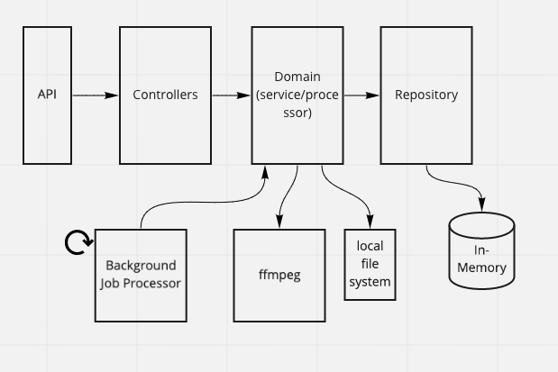

# Concatenate Videos

### Running the application

Run the docker container locally:

```
docker-compose up --build

```

Container is mapped to port 8000


### API Call Flow

```
POST /jobs
{
    "sourceVideoUrls": ["<url to mp4>", "<url to another mp4>"]
    "destination": {
        "directory": "<local path of directory that'll store merged file>"
    }
}
```

returns

```
{
    "id": "<job id>"
    "status": "<url to status of job>"
}
```

```
GET /job/{jobId}/status
```

returns

```
{
    "status": "pending"
}
```

### Architecture


